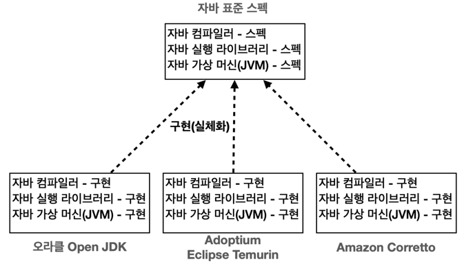
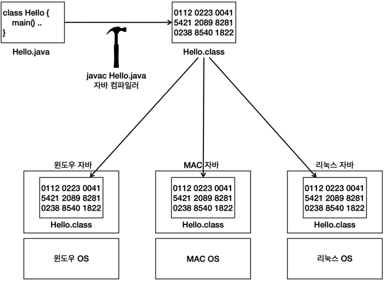

# 자바란?
## 자바 표준 스펙
### 자바 표준 스펙과 구현

- 자바 표준 스펙 : 자바의 설계도, 문서. 표준 스펙을 기반으로 여러 회사에서 실제 자바를 만듦
- 다양한 자바 구현 : 각 회사에서 만든 자바마다 장단점 존재

### 변경의 용이

- 자바 표준 스펙에 맞추어 개발됨 -> A 회사에서 구현한 걸 사용하다가 B 회사에서 구현할 걸 사용해도 거의 아무런 문제 X

## 컴파일과 실행
- javac : 자바 컴파일러 .java -> .class
  - 소스 코드를 바이트 코드로 변경
  - 더 빠른 실행을 위한 최적화 : 가상 머신에서 더 빠르게 실행
  - 문법 오류 검출
- java : 자바 실행
  - 자바 가상 머신(JVM) 실행되면서 프로그램 작동

### 인텔리 제이에서의 자바 컴파일, 실행 과정(자동적으로 다 해줌)
- 컴파일(.java -> .class)
  - 자바 코드 컴파일 시 원래 직접 javac 명령어로 실행
    : 인텔리제이가 이 과정 자동화

- 실행
  - 자바 실행 시 java 명령어로 실행
    : .class 파일 지정해주고 자동 실행

## 자바와 운영체제 독립성
### 일반적인 프로그램
- 윈도우 프로그램
  - 일반적인 프로그램은 다른 운영체제에서 실행할 수 없음
    : 특정 윈도우에서 사용한 명령어 구성이 있기 때문에 호환 X
    
    예) exe 파일 macOS 동작 X
### 자바 프로그램

- 자바 프로그램
  - 자바가 설치된 모든 OS 에서 실행 가능(OS 종속 X)
  - OS 용 자바가 각각 존재함

### 자바 개발과 운영 환경
- 우리가 로컬 환경(macOS, windows) 에서 개발한 프로그램을 배포 서버 환경(linux)에서 실행시키려면
  1. 배포 서버에 리눅스 자바를 설치한다.
  2. 그리고 실행한다. 끝!

### 정리
- 자바의 운영체제에 대한 독립성